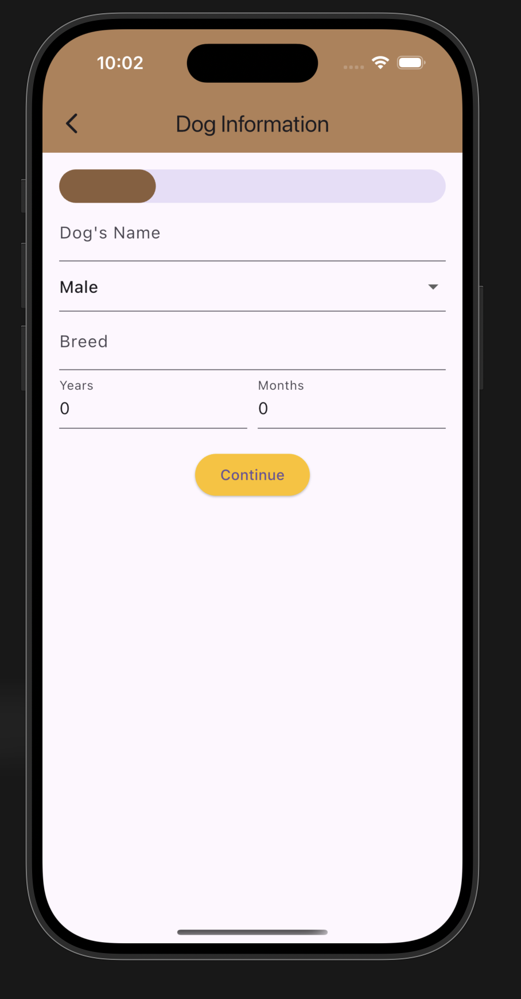
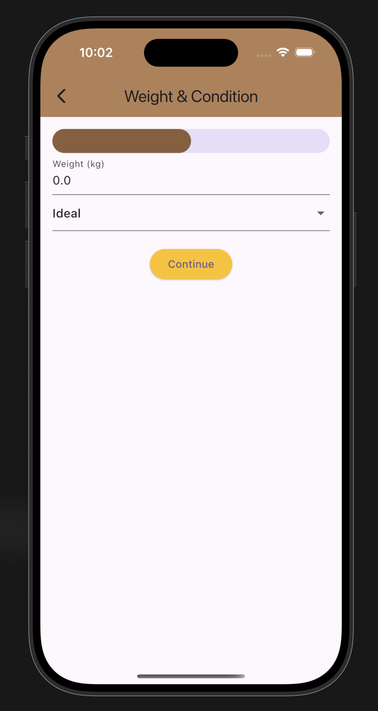
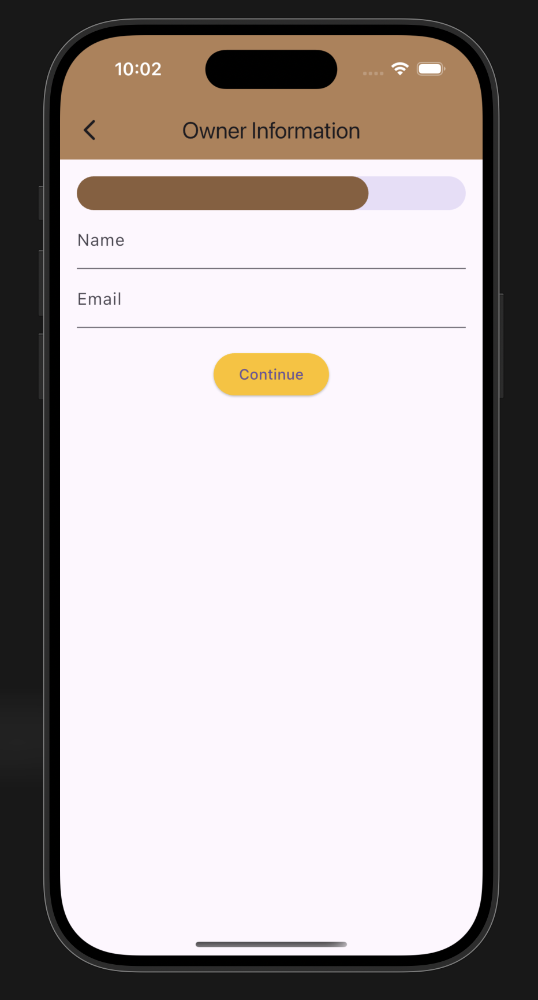

<!DOCTYPE html>
<html lang="en">
<head>
    <meta charset="UTF-8">
    <meta name="viewport" content="width=device-width, initial-scale=1.0">
</head>
<body>
    <h1>Dog Registration App</h1>
    
This Flutter app allows users to register their dogs by providing information about their pets and owners. The registration process is split into several steps, including Dog Information, Weight & Body Condition, Owner Information, and Delivery Address.

    <h2>Features</h2>
    <ul>
        <li><strong>Multi-step Registration:</strong> The app allows users to input their dog and owner details across multiple pages.</li>
        <li><strong>Progress Indicator:</strong> The app shows a linear progress bar that updates as users move through the registration steps.</li>
        <li><strong>Responsive UI:</strong> Designed with custom paddings and margins for a clean and consistent layout.</li>
        <li><strong>Confirmation Dialog:</strong> After filling in all the details, users are shown a confirmation dialog with the entered information.</li>
    </ul>
    <h2>Getting Started</h2>
    
To run this project locally, you need to have Flutter installed. Follow the instructions below to get started.

    <h3>Prerequisites</h3>
    
Make sure you have Flutter installed. If you don't have it yet, follow the installation guide on the official Flutter website: <a href="https://flutter.dev/docs/get-started/install" target="_blank">Flutter Installation</a>.

    <h3>Clone the repository</h3>
    <pre><code>git clone https://github.com/Madhan-Rkv-10/flutter-registration-progress.git
cd dog-registration-app</code></pre>
    <h3>Install dependencies</h3>
    
Run the following command to install all necessary dependencies:

    <pre><code>flutter pub get</code></pre>
    <h3>Run the app</h3>
    
After dependencies are installed, you can run the app using the following command:

    <pre><code>flutter run</code></pre>
    <h2>Screenshots</h2>
    
Here are some screenshots showcasing the different stages of the registration process:

    <h3>Step 1: Dog Information</h3>
    
    <h3>Step 2: Weight & Body Condition</h3>
    
    <h3>Step 3: Owner Information</h3>
    
    <h2>App Structure</h2>
    <ul>
        <li><strong>lib/:</strong> Contains the main application code.</li>
        <ul>
            <li><strong>main.dart:</strong> Entry point of the application and app configuration.</li>
            <li><strong>HomePage:</strong> The home page displays the registration data and allows users to navigate to the registration process.</li>
            <li><strong>DogRegistration:</strong> Handles the multi-step registration process with pages for dog information, weight, owner info, and address.</li>
            <li><strong>RegistrationData:</strong> Model class to hold registration data for both the dog and the owner.</li>
            <li><strong>DogRegistrationWizardMixin:</strong> A mixin to help navigate between registration steps.</li>
        </ul>
    </ul>
    <h3>Constants and Themes</h3>
    <ul>
        <li><strong>DogFoodAppTheme:</strong> Contains constants for the app's color scheme and padding/margin values, used throughout the app to maintain consistency.</li>
        <li><strong>Margins & Paddings:</strong> The app defines reusable constants for vertical and horizontal margins and padding for a uniform design.</li>
    </ul>
    <h2>Contributing</h2>
    
Contributions are welcome! If you'd like to contribute, please fork the repository, create a new branch, and submit a pull request with your changes.

    <h2>License</h2>
    
This project is licensed under the MIT License - see the <a href="LICENSE" target="_blank">LICENSE</a> file for details.

</body>
</html>
